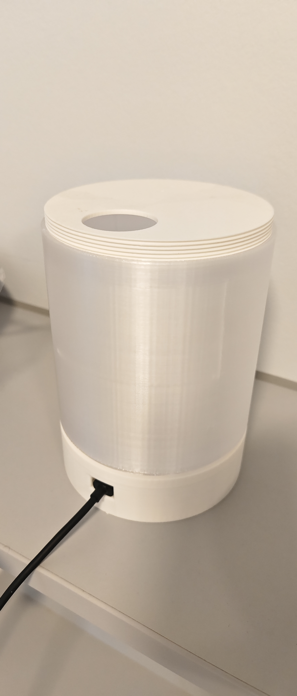
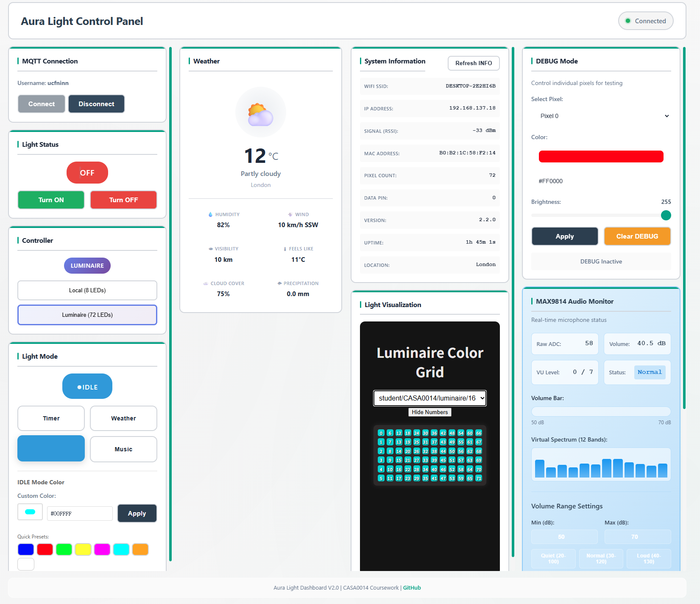

# Arua Light
**CASA0014, UCL 2025**


## 1. What it does
This project is an MQTT-based IoT device with four modes—Timer, Weather, Idle, and Music—and built-in LED visualizations.
- Timer (WIP): Receives timer commands over MQTT. LEDs gradually turn off as time passes; when the timer ends, they flash until the button is pressed.
- Weather: Detects the current city via IP and fetches weather data from wttr.in. It first shows a 5-second “weather info chart,” then an animation of the current condition.
    - Weather info chart:
        1. Humidity: blue; higher humidity = brighter blue.
        2. Wind speed: white moving dot(s); faster wind = faster motion; up to 3 dots for high wind.
        3. Visibility: white brightness scaled from 5 km to 20 km; off below 5 km; full on above 20 km.
        4. Temperature color:
             - < 0°C: white
             - 0–10°C: blue
             - 10–20°C: green
             - 20–30°C: yellow
             - \> 30°C: red
        5. Feels-like temperature: aqua if lower than actual; orange if higher than actual.
        6. Cloud cover: brown; higher cloud cover = brighter brown.
    - Condition animation: animations for clear, cloudy, rain, snow, thunderstorm, and fog.
- Idle: Breathing light effect with configurable color.
- Music: Captures ambient audio via a Max9814 microphone and analyzes it with ArduinoFFT. The on-device NeoPixels map sound intensity to color and height, and the 72-LED array renders a spectrum.

## 2. Hardware
1.  Arduino MKR WiFi 1010
2.  Max9814 Microphone Amplifier
3.  Neopixel LED Strip (8 LEDs)
4. NC (normally closed) push button
5. Micro USB cable
6. Breadboard and jumper wires
7. Optional: 3D-printed enclosure

## 3. Wiring diagram


## 4. Libraries
1.  WIFININA by Arduino
2.  Adafruit NeoPixel by Adafruit
3.  Arduinojson by Benoit Blanchon
4.  arduinoFFT by Enrique Condes

## 5. How to run
1.  ```git clone https://github.com/iiishop/Aura_Light```
2.  Install Arduino IDE and the libraries mentioned above.
3.  Open the `Arua_Light.ino` file in Arduino IDE.
4.  Create a `arduino_secrets.h` file in the same directory as `Arua_Light.ino` with the following content:
    ```cpp
    #ifndef ARDUINO_SECRETS_H
    #define ARDUINO_SECRETS_H

    struct WiFiCredentials
    {
        const char *ssid;
        const char *password;
    };

    const WiFiCredentials WIFI_NETWORKS[] = {
        {"YOUR SSID 1", "YOUR PASSWORD 1"},
        {"YOUR SSID 2", "YOUR PASSWORD 2"},
        {"......", "......"},

    };

    const int WIFI_NETWORK_COUNT = sizeof(WIFI_NETWORKS) / sizeof(WIFI_NETWORKS[0]);

    #define SECRET_SSID WIFI_NETWORKS[0].ssid
    #define SECRET_PASS WIFI_NETWORKS[0].password

    #define MQTT_SERVER "YOUR MQTT SERVER ADDRESS"
    #define MQTT_PORT 1884
    #define MQTT_USERNAME "YOUR MQTT USERNAME"
    #define MQTT_PASSWORD "YOUR MQTT PASSWORD"

    #define MQTT_USER "YOUR DEVICE IDENTIFIER"

    #endif

    ```
5.  Modify the `SECRET_SSID`, `SECRET_PASS`, `MQTT_SERVER`, `MQTT_PORT`, `MQTT_USERNAME`, `MQTT_PASSWORD`, and `MQTT_USER` macros in the `arduino_secrets.h` file with your own information.
6.  Connect the hardware as per the wiring diagram.
7.  Select the correct board and port in Arduino IDE.
8.  Upload the code to the Arduino MKR WiFi 1010.
9.  Open the Serial Monitor to see the debug information.
10. You can use the button to control this device.
    - Short press (<0.3s): Switch between modes (Timer -> Weather -> Idle -> Music -> Timer ...)
    - Long press (>=2s): To toggle the light on and off
    - Double press (two presses within 0.6s): To change the local and lumi mode
11. If you want to use some modern method, you can use the Dashboard in this project to control the device, by a http server running on your computer.

    - **Important:** Sensitive MQTT connection information (broker, port, username,password) is now stored in `dashboard/js/config.secret.js`. You must create and editthis file with your own server details. Example:
    ```js
    // dashboard/js/config.secret.js
    export const MQTT_SECRET = {
            broker: 'YOUR_MQTT_BROKER',
            port: 1884,
            username: 'YOUR_USERNAME',
            password: 'YOUR_PASSWORD'
    };
    ```
    - Do **not** commit this file to public repositories.
    - The Dashboard will automatically use these credentials.
    - Then open the `index.html` file in the `Dashboard` folder in your web browser.

## 6. MQTT Topics

**Base Topic Format**: `student/CASA0014/{username}`  
Replace `{username}` with your device ID (defined in `arduino_secrets.h` as `MQTT_USER`).

### 6.1 Arduino Subscribed Topics

Arduino device subscribes to the following topics to receive control commands:

#### Core Control Topics
- `student/CASA0014/{username}/status` - Device on/off state (`on` / `off`)
- `student/CASA0014/{username}/mode` - Light mode (`timer` / `weather` / `idle` / `music`)
- `student/CASA0014/{username}/controller` - Controller selection (`local` / `luminaire`)

#### Debug Topics
- `student/CASA0014/{username}/debug/#` - All debug topics (wildcard)
- `student/CASA0014/{username}/debug/color` - Debug color (e.g., `#FF0000`)
- `student/CASA0014/{username}/debug/brightness` - Debug brightness (`0-255`)
- `student/CASA0014/{username}/debug/index` - Debug LED index (`0-71`)

#### Feature Control Topics
- `student/CASA0014/{username}/idle/color` - IDLE mode custom color (e.g., `#0000FF`)
- `student/CASA0014/{username}/audio/volume_range` - Audio volume range
- `student/CASA0014/{username}/info/weather` - Weather JSON data (for Luminaire weather visualization)
- `student/CASA0014/{username}/refresh` - Refresh request (`info` / `all`)

### 6.2 Arduino Published Topics

Arduino device publishes to the following topics to report status and data:

#### Status Information Topics
- `student/CASA0014/{username}/status` - Current state (Retained)
- `student/CASA0014/{username}/mode` - Current mode (Retained)
- `student/CASA0014/{username}/controller` - Current controller (Retained)

#### System Information Topics (Info)
- `student/CASA0014/{username}/info/wifi/ssid` - WiFi SSID (Retained)
- `student/CASA0014/{username}/info/wifi/ip` - IP address (Retained)
- `student/CASA0014/{username}/info/wifi/rssi` - WiFi signal strength (Retained)
- `student/CASA0014/{username}/info/wifi/mac` - MAC address (Retained)
- `student/CASA0014/{username}/info/lighter/number` - LED count (Retained)
- `student/CASA0014/{username}/info/lighter/pin` - NeoPixel pin (Retained)
- `student/CASA0014/{username}/info/system/version` - System version (Retained)
- `student/CASA0014/{username}/info/system/uptime` - Uptime in seconds
- `student/CASA0014/{username}/info/location/city` - Current city (Retained)
- `student/CASA0014/{username}/info/idle/color` - IDLE mode color (Retained)
- `student/CASA0014/{username}/info/weather` - Weather JSON data (Retained)
- `student/CASA0014/{username}/info/audio/data` - Audio spectrum data

#### Luminaire Control Topics
- `student/CASA0014/luminaire/{id}` - Luminaire RGB data (216 bytes raw data, 72 LEDs × 3 bytes RGB)
- `student/CASA0014/light/{username}/` - Local controller RGB data

### 6.3 Dashboard (Web) Topics

Dashboard interacts with the following topics via browser MQTT client:

#### Subscribed Topics (Receive)
Dashboard subscribes to these topics to monitor device status:
- `student/CASA0014/{username}/status` - Listen for status changes
- `student/CASA0014/{username}/mode` - Listen for mode changes
- `student/CASA0014/{username}/controller` - Listen for controller switches
- `student/CASA0014/{username}/debug/#` - Listen for all debug messages (wildcard)
- `student/CASA0014/{username}/info/#` - Listen for all system information (wildcard)

The wildcard subscriptions automatically receive messages from these subtopics:
- **Debug subtopics**: `/debug/color`, `/debug/brightness`, `/debug/index`
- **Info subtopics**: `/info/wifi/ssid`, `/info/wifi/ip`, `/info/wifi/rssi`, `/info/wifi/mac`, `/info/lighter/number`, `/info/lighter/pin`, `/info/system/version`, `/info/system/uptime`, `/info/location/city`, `/info/idle/color`, `/info/weather`, `/info/audio/data`

#### Published Topics (Send)
Dashboard can publish to these topics to control the device:
- `student/CASA0014/{username}/status` - Control device on/off
- `student/CASA0014/{username}/mode` - Change light mode
- `student/CASA0014/{username}/controller` - Switch controller
- `student/CASA0014/{username}/debug/color` - Send debug color
- `student/CASA0014/{username}/debug/brightness` - Send debug brightness
- `student/CASA0014/{username}/debug/index` - Send debug LED index
- `student/CASA0014/{username}/idle/color` - Set IDLE mode color
- `student/CASA0014/{username}/refresh` - Request device to republish info

### 6.4 Examples

Assuming `MQTT_USER` is set to `ucfninn`, the topics would be:

**Subscribe Examples**:
- Control topic: `student/CASA0014/ucfninn/status`
- Mode topic: `student/CASA0014/ucfninn/mode`
- Weather data: `student/CASA0014/ucfninn/info/weather`

**Publish Examples**:
- WiFi info: `student/CASA0014/ucfninn/info/wifi/ip`
- System version: `student/CASA0014/ucfninn/info/system/version`
- Luminaire data: `student/CASA0014/luminaire/16`

### 6.5 Notes

1. **Retained Messages**: Most `info/*` topics use the retained flag to ensure newly connected clients immediately receive the latest state
2. **Wildcard Subscriptions**: 
   - `debug/#` matches all debug topics
   - `info/#` matches all info topics
3. **Audio Data**: `info/audio/data` does not use retained flag to avoid stale data
4. **Bidirectional Communication**: Some topics (like `status`, `mode`) support both subscribe and publish for bidirectional synchronization

## 7. Dashboard(WIP)
[Dashboard Link](./dashboard/index.html)
